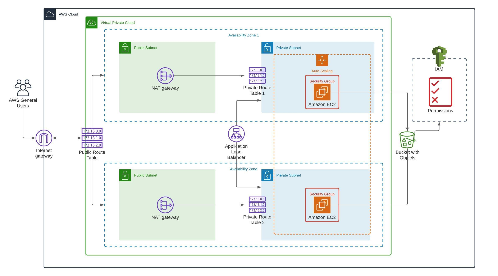
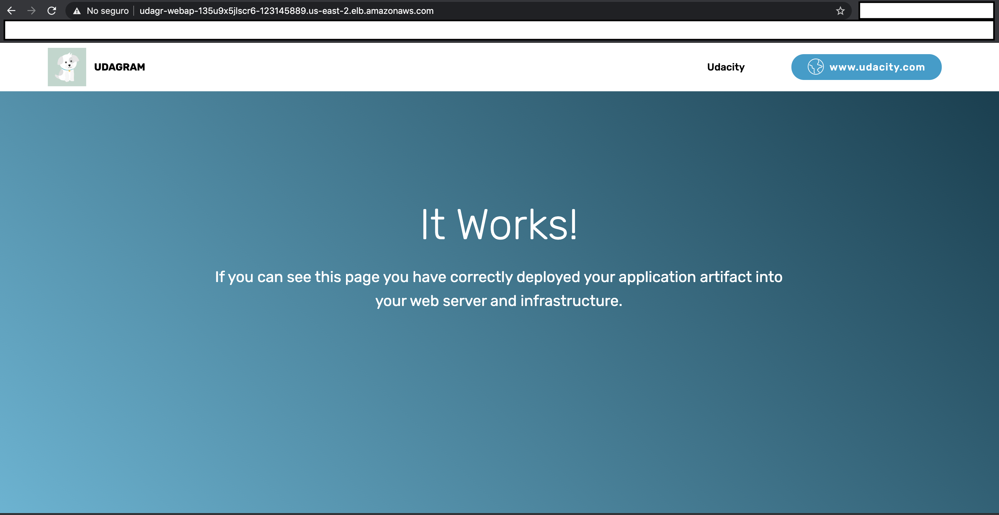

# Deploy a High Availability website

- In this project was to build Infraestructure as a code to serve a website in AWS. For this, I use AWS CLI tool and __lucidchart__ for the infraestructure and server diagram.

## Diagram

## Result Website screenshot

## Files

- __appinfraservers.yml__: Contains the template code to build and run the website infraestructure and servers in AWS
- __appinfraservers-params.yml__: Contains the hard coded parameters that the template need to run
- __create-stack__: shell script that creates a stack in AWS based in the template and paramnters files
- __update-stack__: shell script that updates the initial stack
- __remove-stack__: shell script that removes the stack from AWS

## Usage

- To use the code and build the stack in AWS, log into the AWS CLI tool in your terminal and run:

> sh ./create-stack.sh [name of the stack] appinfraservers.yml appinfraservers-params.json
